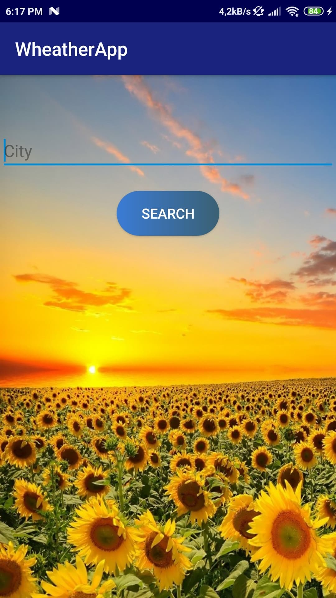
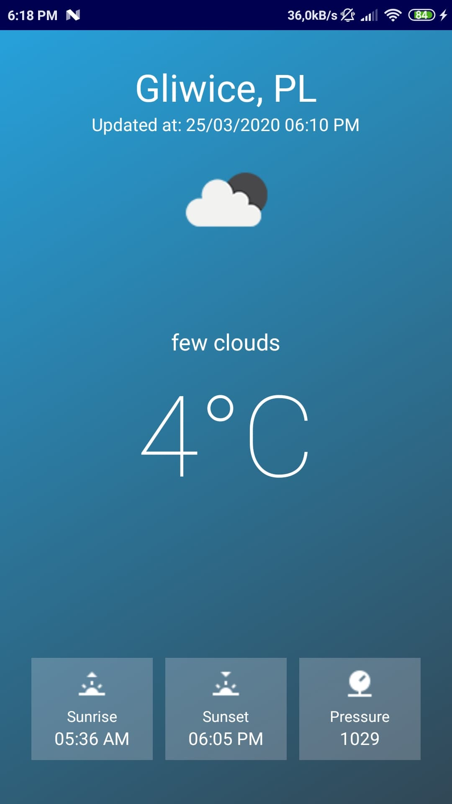

# WheatherApp
 > Android, Kotlin, OpenWeatherMap API (https://openweathermap.org/api)
 
Simple mobile weather application for android. After entering the appropriate input data, the application displays
basic weather information of a given city, such as temperature and atmospheric pressure.
 
 #### Main screen
 

#### City weather data screen
 

